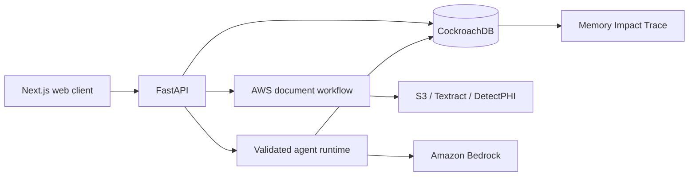

# BoneTwin

BoneTwin is a trustworthy longitudinal memory agent for organizing bone-density reports,
corrections, unresolved questions, and human review decisions. Its differentiator is a
visible Memory Trust Engine: stored provenance, verification state, validity, supersession,
and retrieval disposition explain why durable memory changed a later action.

> **Local product status:** Phases 2–9 have a tested synthetic vertical slice with FastAPI,
> local mock AWS ingestion, CockroachDB-backed trusted-memory behavior, an optional live
> Amazon Bedrock runtime, human review, a
> polished responsive UI,
> read-only MCP views, and reproducible safety evaluation. The AWS CDK application
> synthesizes successfully. Cloud deployment, managed MCP activation, and AgentCore require
> credentials and are not represented as complete. Local Bedrock support is implemented but
> cannot be marked live-verified until credentials and a chat model ID are supplied. Local
> workflow persistence uses the same CockroachDB tables intended for hosting.

## Run the complete local demo

On Windows, use the one-command durable local runner. It installs dependencies, starts local
CockroachDB, applies migrations, seeds only synthetic records, generates the demo PDFs, and
starts the API and web client:

```powershell
.\scripts\run_local.ps1
```

After the first run, dependency installation can be skipped:

```powershell
.\scripts\run_local.ps1 -SkipInstall
```

To keep the UI and API local while using real Amazon Bedrock for Titan embeddings and agent
decisions, configure AWS as described below and run:

```powershell
$env:AWS_PROFILE = "bonetwin"
$env:AWS_REGION = "us-west-2"
.\scripts\run_local.ps1 -UseBedrock -SkipInstall
```

To additionally store durable state in CockroachDB Cloud and gate agent retrieval through the
CockroachDB Cloud managed MCP server using LangChain:

```powershell
$env:DATABASE_URL = "postgresql://<sql-user>:<password>@<cluster-host>:26257/bonetwin?sslmode=verify-full"
$env:COCKROACH_CLUSTER_ID = "<cluster-uuid>"
$env:COCKROACH_MCP_API_KEY = "<dedicated-service-account-secret>"
$env:MCP_READONLY_DATABASE = "bonetwin"
.\scripts\run_local.ps1 -UseBedrock -UseCockroachCloudMcp -SkipInstall
```

This explicit Cloud command applies migrations and synthetic seed data to the database in
`DATABASE_URL`, then runs the MCP readiness check before starting the local UI/API. Do not point
it at a production or patient-data database.

The equivalent manual commands are:

```bash
python -m uv sync --locked
npx pnpm install --frozen-lockfile
docker compose up -d --wait cockroach
python -m uv run python -m scripts.migrate
python -m uv run python -m scripts.seed
npx pnpm dev
```

On Windows, the repository can verify the complete credential-free local setup first:

```powershell
.\scripts\verify_local_setup.ps1
```

Open [http://127.0.0.1:3000](http://127.0.0.1:3000), then choose **Try demo account** to enter
the working application at `/demo`. The API runs at
[http://127.0.0.1:8000/docs](http://127.0.0.1:8000/docs) and uses the local
`demo-clinician` bearer identity through the typed client.

Suggested flow:

1. Choose **Try demo account**, then use **Upload report** to download one of the generated demo
   PDFs.
2. Select that PDF from your device and choose **Upload and process**.
3. Inspect **Parsed report** and its source-backed measurement table.
4. Run the trusted comparison from **Overview**.
5. Inspect used and excluded memories in **Memory trace**.
6. Approve the task in **Review tasks**.
7. Use the profile control to start a new session, run the comparison again, and observe
   that the prior review is retrieved.

The browser now sends the exact selected PDF bytes. Local mode verifies the SHA-256 and byte
count, parses the PDF in memory, and discards the raw bytes after processing. The included
reports are generated, fictional, and visibly marked as not medical records; never use real
patient data in local mode.

To keep the app local while exercising real KMS-encrypted S3 uploads, configure the bucket and
IAM values in [the local S3 guide](docs/s3-local-testing.md), then run:

```powershell
.\scripts\run_local.ps1 -UseS3 -SkipInstall
```

This performs a synthetic presigned PUT/read/delete readiness probe before starting the UI. A
Bedrock bearer token is not an S3 credential; use an S3-capable AWS IAM profile or temporary SDK
credential variables.

The three upload-ready PDFs are also available in [`output/pdf`](output/pdf). Regenerate
them with:

```bash
uv run python -m scripts.generate_demo_documents
```

## Amazon Bedrock credentials for local use

Amazon Bedrock does not use a separate application API key. The SDK signs calls with AWS IAM
credentials. The default command keeps Bedrock offline; `-UseBedrock` makes real, billable
Bedrock calls while CockroachDB, the API, UI, mock authentication, and document parser remain
local.

You need:

- An AWS account with billing enabled and Bedrock available in the selected region.
- AWS credentials through IAM Identity Center/SSO, an AWS profile, or standard SDK environment
  credentials. Never commit access keys.
- `bedrock:InvokeModel` permission for `amazon.titan-embed-text-v2:0` and the selected chat
  model or inference profile.
- A model that supports the Bedrock Converse API, tool use, and forcing a specific tool in the
  selected region. The PowerShell runner defaults to the tested `amazon.nova-lite-v1:0`; set
  `BEDROCK_CHAT_MODEL_ID` to override it.
- Any model-access or provider-use-form prerequisites required by that model.

Recommended SSO setup after installing AWS CLI v2:

```powershell
aws configure sso --profile bonetwin
aws sso login --profile bonetwin
$env:AWS_PROFILE = "bonetwin"
$env:AWS_REGION = "us-west-2"
$env:BEDROCK_CHAT_MODEL_ID = "<your-enabled-model-or-inference-profile-id>"
$env:BEDROCK_MODE = "live"
python -m uv run python -m scripts.check_bedrock_access
.\scripts\run_local.ps1 -UseBedrock -SkipInstall
```

The readiness check sends only fixed synthetic text. The live application also enforces the
synthetic-only boundary, validates every decision against a strict schema, restricts cited
evidence to the retrieved subject scope, and leaves all writes to deterministic application
authorization. The model cannot execute a tool or commit a clinical review decision.

Credential-free local mode remains available for repeatable tests. AgentCore is optional for the
hackathon because the credentialed flow already uses Amazon Bedrock. Do not send or commit any
credential.

## Simplest AWS deployment

The repository includes managed build definitions for a Git-connected deployment:

- `apprunner.yaml` builds and starts the FastAPI service on AWS App Runner.
- `amplify.yml` builds the pnpm/Next.js monorepo on AWS Amplify Hosting.
- Hosted API startup applies migrations and the idempotent synthetic seed to the configured
  CockroachDB Cloud database.

Both services can follow the public GitHub `main` branch and redeploy automatically. The only
values entered in Amplify are the public App Runner URL. Database, Managed MCP, and Bedrock
credentials are referenced from AWS Secrets Manager by App Runner.

Follow the exact console fields and verification checklist in
[docs/aws-managed-hosting.md](docs/aws-managed-hosting.md). This minimal path uses live Amazon
Bedrock and AWS hosting but does not claim AgentCore, Cognito, Textract, or the CDK contract stacks
as deployed.

## CockroachDB Cloud and LangChain MCP credentials

Create a cluster from the [CockroachDB Cloud signup page](https://cockroachlabs.cloud/signup),
then collect these values from the Cloud Console:

- `DATABASE_URL`: the TLS SQL connection string for application storage. This is used by
  SQLAlchemy for authenticated, authorized, idempotent, audited transactions.
- `COCKROACH_CLUSTER_ID`: the UUID visible in the cluster Overview URL.
- `COCKROACH_MCP_API_KEY`: a secret key from a dedicated CockroachDB Cloud service account.
- `MCP_READONLY_DATABASE`: the database containing the migrated BoneTwin schema, normally
  `bonetwin`.

The SQL password and MCP API key are separate credentials. Keep both only in your local
environment or `.env`; the repository ignores `.env`. The local application uses
`langchain-mcp-adapters` with Streamable HTTP, sends the cluster ID and bearer token as headers,
and allowlists only `select_query`. Although the managed server may advertise schema and write
tools, BoneTwin never gives them to the model and never invokes them. Durable writes remain on
the transactional SQL path because MCP `insert_rows` cannot safely replace the multi-table
review, idempotency, and audit transaction.

## Safety and data policy

BoneTwin supports document understanding and review preparation. It does not diagnose,
predict fractures, recommend medication, or make treatment decisions. Use only synthetic or
fully de-identified data. See [the synthetic-data policy](docs/synthetic-data-policy.md).

## Architecture



The local end-to-end workflow writes structured reports, measurements, vectors, agent runs,
retrieval dispositions, review decisions, verified memory, and audits to CockroachDB. A fresh
API/store instance retrieves the prior review and changes the next action. Hosted deployment
must replace only the explicitly labeled AWS/auth adapters and use CockroachDB Cloud.

## Prerequisites

- Git
- Python 3.12
- [uv](https://docs.astral.sh/uv/)
- Node.js 22 or newer
- pnpm 11.17.0
- GNU Make (optional convenience wrapper)
- Docker Desktop for the recommended local CockroachDB path

On Windows without Docker, the repository includes a checksum-verified CockroachDB v26.2.4
installer and local launcher.

## Fresh-clone setup

```bash
git clone <repository-url> bonetwin
cd bonetwin
uv sync --locked
pnpm install --frozen-lockfile
```

Copy `.env.example` to `.env` for local configuration. Its default database URL is local and
contains no credential.

With GNU Make:

```bash
make install
make check
```

## CockroachDB foundation

Start CockroachDB with Docker, migrate from zero, and seed deterministic synthetic records:

```bash
make dev-infra
make migrate
make seed
make test-integration
```

On PowerShell without Docker:

```powershell
.\scripts\install_cockroach_windows.ps1
.\scripts\start_cockroach_windows.ps1
$env:DATABASE_URL = "postgresql://root@127.0.0.1:26257/bonetwin?sslmode=disable"
python -m uv run python -m scripts.migrate
python -m uv run python -m scripts.seed
$env:BONETWIN_RUN_DB_TESTS = "1"
python -m uv run pytest -m integration
```

The local server is insecure and loopback-only; never use this mode for deployment. Stop the
Windows process with `.\scripts\stop_cockroach_windows.ps1`.

For CockroachDB Cloud, set `DATABASE_URL` to an administrator migration connection and run
the same migration and seed modules. Do not commit the URL. See
[docs/database.md](docs/database.md).

Without Make, run:

```bash
uv run ruff format --check .
uv run ruff check .
uv run mypy services evaluations scripts
uv run pytest -m "not integration"
pnpm format:check
pnpm lint
pnpm typecheck
pnpm test
uv run python scripts/check_no_secrets.py
```

## Read-only MCP inspector

Migration `0003_mcp_readonly_views` creates a purpose-specific role that can select from
three synthetic-subject views and cannot write to application tables. With local
CockroachDB running:

```bash
make mcp-audit
```

Cloud connection and judge prompts are documented in
[docs/mcp-setup.md](docs/mcp-setup.md) and
[docs/mcp-demo-prompts.md](docs/mcp-demo-prompts.md). Managed MCP activation remains a
credentialed deployment step.

## Phase 9 evaluation

Run all release gates over the 30 deterministic synthetic timelines:

```bash
make eval
```

The checked-in [evaluation report](evaluations/reports/phase9-latest.md) compares
most-recent-only, unfiltered vector-only, and hybrid trusted-memory retrieval. Dataset and
method details are in [docs/evaluation.md](docs/evaluation.md).

## Workspace map

- `apps/web`: responsive Next.js client scaffold
- `services/api`: FastAPI service boundary
- `services/agent`: Strands/AgentCore runtime boundary
- `services/ingestion`: document workflow and parser boundary
- `packages`: shared TypeScript types and generated API client boundary
- `database`: migrations, seed data, and reviewed queries
- `infrastructure`: AWS CDK and CockroachDB automation
- `evaluations`: synthetic datasets and reproducible evaluation runners
- `docs`: architecture, safety, decisions, and implementation evidence

The full implementation contract is in `CODEX_IMPLEMENTATION_SPEC.md`. Current acceptance
evidence is in [docs/implementation-status.md](docs/implementation-status.md).

## License and prior work

New BoneTwin work is MIT licensed. The prior Bone Health Tracker concept, prototype, and
custom BMD parser are explicitly disclosed in [NOTICE-PREEXISTING.md](NOTICE-PREEXISTING.md).
